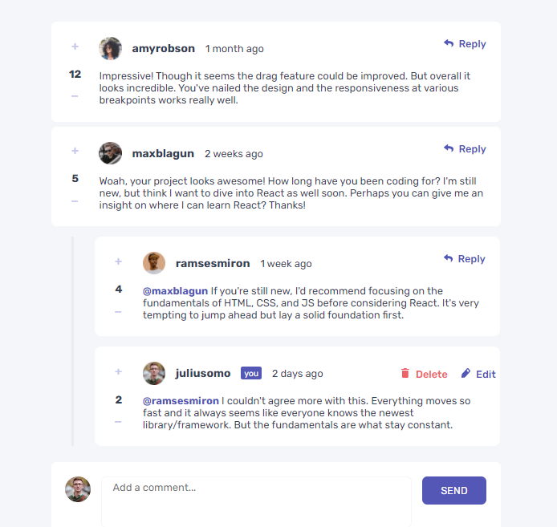

# Frontend Mentor - Interactive comments section solution

This is a solution to the [Interactive comments section challenge on Frontend Mentor](https://www.frontendmentor.io/challenges/interactive-comments-section-iG1RugEG9). Frontend Mentor challenges help you improve your coding skills by building realistic projects.

## Table of contents

- [Overview](#overview)
  - [The challenge](#the-challenge)
  - [Screenshot](#screenshot)
  - [Links](#links)
- [My process](#my-process)
  - [Built with](#built-with)
  - [Useful resources](#useful-resources)
- [Author](#author)

## Overview

### The challenge

Users should be able to:

- View the optimal layout for the app depending on their device's screen size
- See hover states for all interactive elements on the page
- Create, Read, Update, and Delete comments and replies
- Upvote and downvote comments
- **Bonus**: If you're building a purely front-end project, use `localStorage` to save the current state in the browser that persists when the browser is refreshed.
- **Bonus**: Instead of using the `createdAt` strings from the `data.json` file, try using timestamps and dynamically track the time since the comment or reply was posted.

### Screenshot

### Links

- Live Site URL: [Live on Vercel](https://interactive-comments-section-frontend-mentor.vercel.app/)

## My process

### Built with

- Semantic HTML5 markup
- Flexbox
- Typescript
- Express
- [React](https://reactjs.org/)
- [Sass](https://sass-lang.com/)

### Useful resources

- [CORS proxy](https://stackoverflow.com/questions/43262121/trying-to-use-fetch-and-pass-in-mode-no-cors/43268098#43268098) - Big thanks to sideshowbarker for the easy to follow step by step, cors proxy.

## Author

- Frontend Mentor - [mattreee](https://www.frontendmentor.io/profile/mattreee)
- CodePen - [asdjkl123](https://codepen.io/asdjkl123)
